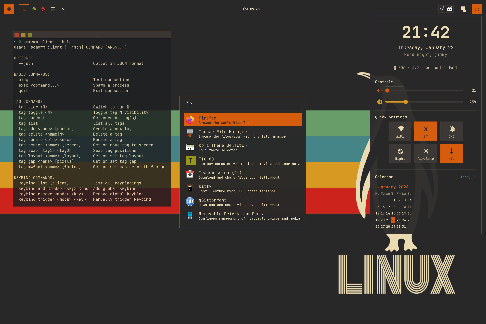
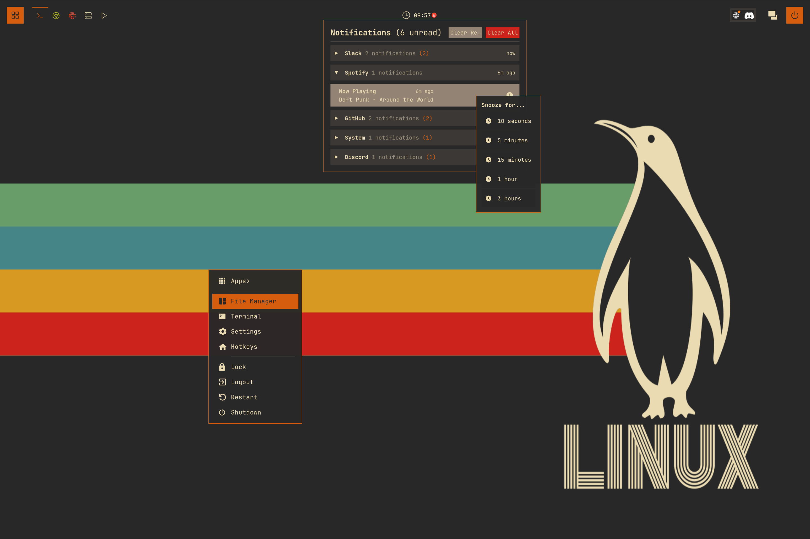
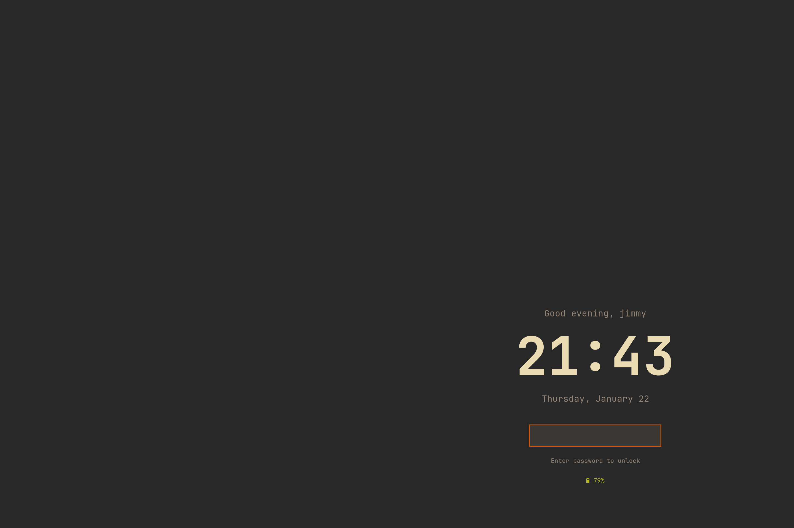

# awesome-from-scratch

A complete AwesomeWM/SomeWM configuration built from scratch, designed as both a fully-functional desktop and a learning resource. **100% native** - no rofi, no polybar, no conky.

This repository is the companion to the [*Awesome From Scratch*](https://somewm.org/docs/tutorials/from-scratch/) tutorial series on somewm.org: thirteen chapters, each with a matching checkpoint branch, that build this configuration one feature at a time.

### Dashboard, Launcher & Tiling


### Notification Center & Power Menu


### Native Lockscreen


## The Tutorial

Each chapter of the series has a branch in this repo holding the finished code for that chapter. Every branch is exactly one commit on top of the previous one, so `git diff 03-widgets 04-wibar` shows you precisely what a chapter adds.

| Branch | Chapter |
|--------|---------|
| [`00-default`](../../tree/00-default) | [The default config](https://somewm.org/docs/tutorials/from-scratch/00-default) |
| [`01-theme`](../../tree/01-theme) | [Theme: palettes, shapes, recolored assets](https://somewm.org/docs/tutorials/from-scratch/01-theme) |
| [`02-keybindings`](../../tree/02-keybindings) | [Keybindings: a table you can read and search](https://somewm.org/docs/tutorials/from-scratch/02-keybindings) |
| [`03-widgets`](../../tree/03-widgets) | [Widgets: wrappers, clock, volume, battery, wifi](https://somewm.org/docs/tutorials/from-scratch/03-widgets) |
| [`04-wibar`](../../tree/04-wibar) | [Wibar: our own bar, taglist with state](https://somewm.org/docs/tutorials/from-scratch/04-wibar) |
| [`05-rules-titlebars`](../../tree/05-rules-titlebars) | [Client rules and titlebars](https://somewm.org/docs/tutorials/from-scratch/05-rules-titlebars) |
| [`06-notifications`](../../tree/06-notifications) | [Notifications: routing, history, center](https://somewm.org/docs/tutorials/from-scratch/06-notifications) |
| [`07-exitscreen`](../../tree/07-exitscreen) | [Exit screen: the modal pattern](https://somewm.org/docs/tutorials/from-scratch/07-exitscreen) |
| [`08-mainmenu`](../../tree/08-mainmenu) | [Main menu](https://somewm.org/docs/tutorials/from-scratch/08-mainmenu) |
| [`09-switcher`](../../tree/09-switcher) | [Window switcher](https://somewm.org/docs/tutorials/from-scratch/09-switcher) |
| [`10-launcher`](../../tree/10-launcher) | [Launcher: a menubar replacement from scratch](https://somewm.org/docs/tutorials/from-scratch/10-launcher) |
| [`11-dashboard`](../../tree/11-dashboard) | [Dashboard: the control center](https://somewm.org/docs/tutorials/from-scratch/11-dashboard) |
| [`12-lockscreen`](../../tree/12-lockscreen) | [Lock screen](https://somewm.org/docs/tutorials/from-scratch/12-lockscreen) |

`12-lockscreen` is the last checkpoint; its tree is identical to `main`.

### Run any checkpoint safely

```bash
git checkout 04-wibar
somewm-client test start --config "$PWD/rc.lua" --name afs
```

That opens a nested SomeWM in a window; your real session is untouched. AwesomeWM users can do the same with Xephyr - see the [series introduction](https://somewm.org/docs/tutorials/from-scratch/).

## Features

### Dashboard / Control Center
Press `Super+D` to toggle a control center featuring:
- Time and date with personalized greeting
- Volume and brightness sliders
- Quick toggles: WiFi, Bluetooth, DND, Night Light, Airplane Mode, Microphone
- Interactive calendar with month navigation

### Native App Launcher
Press `Super+P` for a fuzzy-search application launcher:
- Parses `.desktop` files automatically
- Fuzzy matching with intelligent scoring
- Persistent icon cache for instant startup
- Keyboard navigation and Tab completion

### Exit Screen
Press `Super+Shift+E` for a full-screen power menu:
- Lock, Logout, Suspend, Reboot, Shutdown
- Keyboard shortcuts for each action
- Arrow key and vim-style navigation

### Wibar
A clean, functional status bar with:
- Custom taglist with per-tag icons
- Centered clock with unread-notification badge
- System tray, volume, WiFi, and battery widgets
- Power button

### Notifications
A full notification system with:
- Notification history and unread tracking
- Do Not Disturb mode and snoozing
- Rule-based positioning and styling per app
- Notification center popup (`Super+Shift+N`)

### Window Switcher & Main Menu
- `Super+Tab` cycles windows by focus history
- `Super+W` opens a keyboard-driven main menu

### Native Lockscreen
- Built on SomeWM's session-lock API with PAM authentication
- Multi-monitor covers, caps-lock warning, failed-attempt counter

### Theme
Gruvbox (or Nord) colorscheme throughout, with:
- One palette, switched by a single variable
- One font family, sized through `beautiful.font_size()`
- DPI-aware sizing and recolored SVG icons
- Consistent shapes via a global `shape_style` switch

## Key Bindings

| Key | Action |
|-----|--------|
| `Super+D` | Toggle dashboard |
| `Super+P` | App launcher |
| `Super+W` | Main menu |
| `Super+Tab` | Window switcher |
| `Super+Shift+E` | Exit screen |
| `Super+Shift+N` | Notification center |
| `Super+Return` | Terminal |
| `Super+S` | Show keybinding help |
| `Super+J/K` | Focus next/prev client |
| `Super+H/L` | Resize master |
| `Super+1-5` | Switch to tag |
| `Super+Shift+1-5` | Move client to tag |
| `Super+Ctrl+R` | Reload config |

## Quick Start

```bash
git clone https://github.com/trip-zip/awesome-from-scratch.git

# For SomeWM (Wayland)
cp -r awesome-from-scratch ~/.config/somewm

# For AwesomeWM (X11)
cp -r awesome-from-scratch ~/.config/awesome

# Restart your compositor
```

## Dependencies

**Required:**
- [SomeWM](https://github.com/trip-zip/somewm) or AwesomeWM 4.3+
- JetBrainsMono Nerd Font

**Optional (for full functionality):**
- wpctl (volume control)
- brightnessctl (brightness control)
- nmcli (WiFi toggle)
- bluetoothctl (Bluetooth toggle)
- gammastep (night light)
- playerctl (media controls)
- upower (battery status)

## Directory Structure

```
rc.lua              Entry point: tags, wallpaper, rules, screen setup
theme/theme.lua     Colors, fonts, shapes, every theme variable
keybindings.lua     Table-driven keybindings
modal.lua           Shared popup + keygrabber lifecycle for overlay UIs
wibar.lua           The bar (per-screen factory)
notifications.lua   Rules, history, DND, snooze, notification center
dashboard/          Control center: profile, sliders, toggles, calendar
launcher/           Fuzzy-search app launcher with icon cache
exitscreen/         Full-screen power menu
lockscreen/         Native session lock (SomeWM)
widgets/            Bar widgets: clock, volume, wifi, battery, taglist,
                    window switcher, main menu, power button
icons/              Feather-style SVGs, recolored at load time
wallpapers/         Default wallpapers
```

## Customization

- **Colors**: edit `color_scheme` in `theme/theme.lua` (`gruvbox` or `nord`)
- **Font**: edit `theme.font_family` in `theme/theme.lua` (one line)
- **Corners**: edit `theme.shape_style` (`rectangle` or `rounded`)
- **Tags**: edit the `tags` table at the top of `rc.lua`
- **Apps**: `terminal`/`filemanager` in `rc.lua`, the `apps` table in `widgets/mainmenu.lua`

## Credits

- [AwesomeWM](https://awesomewm.org/) - the window manager framework
- [SomeWM](https://github.com/trip-zip/somewm) - the Wayland compositor this config grew up on
- [Gruvbox](https://github.com/morhetz/gruvbox) and [Nord](https://www.nordtheme.com/) - color palettes
- [Feather Icons](https://feathericons.com/) - the SVG icon set

## License

MIT
